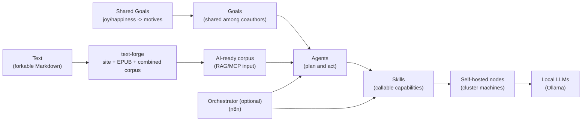

# Thunder Forge

Infrastructure/process layer for running **self-hosted AI capabilities** to follow **Shared Goals**.

Thunder Forge focuses on operating the compute and automation stack that can work with **private data** (finance, healthcare, family/child privacy) without relying on third-party hosted agents.

- GitHub org: https://github.com/shared-goals/
- This repo: https://github.com/shared-goals/thunder-forge

## Shared Goals (idea)

A **personal image of Joy and Happiness** is treated as the base source of motives.

Details (RU): [Shared Goals — use case and concept](https://text.sharedgoals.ru/ru/p2-180-sharedgoals/#use_case)

- A *motive* is a reason to act (rooted in what brings joy/happiness).
- A *goal* is a direction or outcome shaped by one or more motives.
- When goals are **shared among coauthors**, motives combine and the overall dynamics increase.

## “Text” as a forkable source of goals

Shared Goals is developed as a living **Text** that anyone can fork and rewrite into their own.

- Concept Text (evolving): https://github.com/bongiozzo/whattodo
- Common build submodule: https://github.com/shared-goals/text-forge

`text-forge` transforms a Text repository into:

- a website (with link-sharing functionality in the publishing format)
- an EPUB book
- a combined Markdown corpus suitable for AI usage (RAG/MCP agents and skills)

## What Thunder Forge manages

Thunder Forge is the infrastructure/process layer for **self-hosted execution** of agents and skills.

Typical managed parts:

- **Nodes**: machines in a self-hosted cluster (e.g., several Mac Studios)
- **LLMs on nodes**: models served locally via Ollama (https://github.com/ollama/ollama)
- **Automation/agents runtime**: workflows and long-running processes (often via n8n)
  - n8n: https://github.com/n8n-io/n8n
- **Skills**: reusable tool capabilities agents can invoke
  - `github_repo` skills (agent skills): https://github.com/agentskills/agentskills

> Note: n8n and skills catalogs are intended integration points. This repo is the
> operational “glue” and runbooks/specs layer to run them self-hosted.

## Ecosystem map

## Privacy & self-hosting principles

Shared Goals activities can involve highly sensitive data.

- Prefer **self-hosted nodes** and **self-hosted agents** for private domains.
- Keep data access **least-privilege** (skills should request only what they need).
- Treat secrets and tokens as production-grade (no plaintext in repos).
- Make agent activity auditable (logs, runs, and permissions).

## Status

This repository is currently at an early scaffolding stage (see [LICENSE](LICENSE)).

Near-term intended contents include:

- node inventory/specs and bootstrap runbooks
- model/LLM deployment conventions (Ollama-managed)
- agent/workflow conventions (including optional n8n patterns)
- a skills registry format + examples
