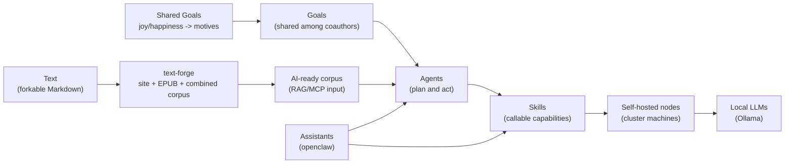

# Thunder Forge

Infrastructure/process layer for running **self-hosted AI capabilities** to follow **Shared Goals**.

Thunder Forge focuses on operating the compute and automation stack that can work with **private data** (finance, healthcare, family/child privacy) without relying on third-party hosted agents.

- GitHub org: https://github.com/shared-goals/
- This repo: https://github.com/shared-goals/thunder-forge

## Shared Goals (idea)

A **personal image of Joy and Happiness** is treated as the base source of motives.

Details (RU): [Shared Goals — use case and concept](https://text.sharedgoals.ru/ru/p2-180-sharedgoals/#use_case)

- A *motive* is a reason to act (rooted in what brings joy/happiness).
- A *goal* is a direction or outcome shaped by one or more motives.
- When goals are **shared among coauthors**, motives combine and the overall dynamics increase.

## "Text" as a forkable source of goals

Shared Goals is developed as a living **Text** that anyone can fork and rewrite into their own.

- Concept Text (evolving): https://github.com/bongiozzo/whattodo
- Common build submodule: https://github.com/shared-goals/text-forge

`text-forge` transforms a Text repository into:

- a website (with link-sharing functionality in the publishing format)
- an EPUB book
- a combined Markdown corpus suitable for AI usage (RAG/MCP agents and skills)

## What Thunder Forge manages

Thunder Forge is the infrastructure/process layer for **self-hosted execution** of agents and skills.

Typical managed parts:

- **Nodes**: machines in a self-hosted cluster (e.g., several Mac Studios)
- **LLMs on nodes**: models served locally via Ollama (https://github.com/ollama/ollama)
- **Assistants**: AI assistants for task execution and automation
  - openclaw: https://github.com/openclaw/openclaw
- **Skills**: reusable tool capabilities agents can invoke
  - `github_repo` skills (agent skills): https://github.com/agentskills/agentskills

> Note: assistants like openclaw and skills catalogs are intended integration points. This repo is the
> operational "glue" and runbooks/specs layer to run them self-hosted.

## Ecosystem map


```mermaid
flowchart LR
  SG["Shared Goals<br/>joy/happiness -> motives"] --> G["Goals<br/>(shared among coauthors)"]

  T["Text<br/>(forkable Markdown)"] --> TF["text-forge<br/>site + EPUB + combined corpus"]
  TF --> K["AI-ready corpus<br/>(RAG/MCP input)"]

  G --> A["Agents<br/>(plan and act)"]
  K --> A

  A --> S["Skills<br/>(callable capabilities)"]
  S --> N["Self-hosted nodes<br/>(cluster machines)"]

  N --> O["Local LLMs<br/>(Ollama)"]

  W["Assistants<br/>(openclaw)"] --> A
  W --> S
```

## Privacy & self-hosting principles

Shared Goals activities can involve highly sensitive data.

- Prefer **self-hosted nodes** and **self-hosted agents** for private domains.
- Keep data access **least-privilege** (skills should request only what they need).
- Treat secrets and tokens as production-grade (no plaintext in repos).
- Make agent activity auditable (logs, runs, and permissions).

## Cluster CLI

Thunder Forge includes a Typer CLI for managing the MLX inference cluster: **4x Mac Studio M4 Max** (128 GB each) + **1x Radxa ROCK 5 ITX+** (ARM64 Linux, infrastructure hub).

### Quick Start

```bash
# Install dependencies
uv sync

# See available commands
uv run thunder-forge --help

# Generate LiteLLM proxy config from cluster definition
uv run thunder-forge generate-config

# Check cluster health
uv run thunder-forge health
```

### Commands

| Command            | Description                                                    |
| ------------------ | -------------------------------------------------------------- |
| `generate-config`  | Generate LiteLLM `proxy_config.yaml` from `configs/*.yml`      |
| `ensure-models`    | Download/sync models to inference nodes via SSH                 |
| `deploy`           | Deploy vllm-mlx services to inference nodes (launchd plist)    |
| `health`           | Run health checks across all cluster nodes                     |

Use `uv run thunder-forge <command> --help` for detailed usage of each command.

#### generate-config

Reads `configs/node-assignments.yaml` (node inventory and model registry), then writes a LiteLLM-compatible `configs/litellm-config.yaml`. Use `--check` to validate without writing.

#### ensure-models

Connects to each inference node via SSH and ensures the required models are downloaded. Compares the desired model set from `configs/node-assignments.yaml` against what is already present on each node.

#### deploy

Generates macOS `launchd` plist files for vllm-mlx on each inference node, copies them over SSH, and starts the services. Handles graceful restart of running services.

#### health

Probes all cluster nodes for SSH reachability, vllm-mlx service status, and model availability. Reports a summary table to the terminal.

### Node Bootstrap

New nodes can be set up with the bootstrap script:

```bash
# On a Mac Studio (inference node)
zsh scripts/setup-node.sh node

# On the Radxa ROCK (gateway / infrastructure hub)
zsh scripts/setup-node.sh gateway
```

The `node` role installs Homebrew, uv, and vllm-mlx, disables macOS sleep, and creates the logs directory. The `gateway` role installs Docker, uv, clones this repo, generates secrets for the Docker Compose stack, starts the services, and generates an SSH key for connecting to inference nodes.

### Configuration

All cluster configuration lives in `configs/`:

- `configs/node-assignments.yaml` -- Node inventory and model assignments (hostnames, IPs, roles, hardware specs, which models on which nodes, memory budgets)

The `generate-config` command produces `configs/litellm-config.yaml` from the assignments file.

### Infrastructure Stack (Docker)

The Radxa ROCK hub runs these services via Docker Compose (`docker/`):

- **LiteLLM** -- OpenAI-compatible proxy that routes requests to inference nodes
- **Open WebUI** -- Chat interface
- **PostgreSQL** -- LiteLLM backend

### CI/CD

Pushes to `main` that touch `configs/`, `src/thunder_forge/`, or `docker/` trigger the deploy workflow (`.github/workflows/deploy.yml`) on a self-hosted runner on the Radxa ROCK.

## Design

See the full design spec: [docs/specs/2026-03-14-thunder-forge-cluster-cli-design.md](docs/specs/2026-03-14-thunder-forge-cluster-cli-design.md)

## Status

This repository is under active development (see [LICENSE](LICENSE)).
